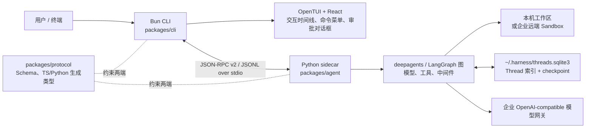

# Harness Code 项目深度分析

> 基于当前仓库源码与文档整理，分析对象为 `Harness Code`（包名/命令名也使用 `za38`）。最后核对日期：2026-07-27。

## 1. 项目是做什么的

Harness Code 是一个面向企业研发场景的**终端 Coding Agent**。用户在终端的图形化文本界面（TUI）中输入需求，Agent 调用企业 OpenAI-compatible 模型，按需读取/搜索/编辑工作区文件、执行命令，并在需要时向用户请求审批或追问。

它不是一个单纯的聊天 CLI：项目特别关注企业内网模型网关、配置与密钥隔离、文件边界、审批、可恢复会话，以及多个会话共享运行资源。当前版本仍处于**源码开发阶段**，没有交付跨平台安装器、预编译发行包或自动更新能力。

核心技术栈如下：

| 层级 | 技术 | 职责 |
| --- | --- | --- |
| CLI / 表现层 | Bun 1.2.19、TypeScript、React、OpenTUI | 参数解析、终端界面、交互、Python 子进程管理 |
| 跨进程协议 | JSON-RPC 2.0、JSONL、JSON Schema | 固定方法名、事件格式、能力协商和双端类型生成 |
| Agent 内核 | Python 3.11+、deepagents、LangChain、LangGraph | 模型调用、工具图、流式输出、审批、中间件 |
| 持久化 | SQLite、LangGraph checkpoint | Thread、模型绑定、提示词 epoch、上下文归档与恢复 |

## 2. 总体架构与一次请求的路径

项目采取“Node 表现层 + Python Agent 内核”的双进程架构。Bun CLI 启动 Python sidecar，双方只通过标准输入/输出交换一行一条的 JSON-RPC 消息；Python 的诊断日志必须写入 stderr，避免污染协议流。



典型交互流程：

1. CLI 解析命令并验证 `--cwd` 指向存在的目录。
2. CLI 以该目录为工作目录启动 `python -m harness_agent`，随后先调用 `initialize` 协商协议 minor 版本和能力集合。
3. Python 读取可信配置、扫描 Skill，建立当前项目的 ThreadStore 和可复用 Runtime Pool。
4. 用户发送任务后，CLI 以 `run.start` 发起请求；服务端为新 Thread 记录消息和不可变模型绑定，并租用或构建对应的 Agent Runtime。
5. LangGraph 图以流式方式调用模型。文本、思考、工具调用、上下文变化和终态统一包装为 `event` 通知回传；TUI 用 `thread_id + run_id + sequence` 排序并渲染时间线。
6. 当工具需要确认或 Agent 使用提问工具时，服务端反向发送 JSON-RPC `request`；TUI 返回标准 response，服务端恢复图执行。
7. run 结束后刷新 SQLite 中的 Thread 摘要并释放 Runtime 租约。后续相同稳定配置的 Thread 可复用该 Runtime。

## 3. 仓库结构与职责

```text
hareness-code/
├── packages/
│   ├── cli/                 # @za38/cli：Bun 入口、IPC 客户端和 OpenTUI
│   ├── protocol/            # @za38/protocol：v2 Schema、代码生成和契约 fixture
│   └── agent/               # za38-agent：Python Agent sidecar
├── docs/
│   ├── user/                # 最终用户的启动、配置、交互和安全说明
│   └── developer/           # 架构、开发工作流、任务和 ADR
├── scripts/project-management.ts # 文档、任务、版本和发布一致性检查
├── package.json             # Bun workspace 根脚本
├── bun.lock                 # Bun 依赖锁文件
├── VERSION                  # 仓库唯一版本来源
└── AGENTS.md                # 本仓库的协作、测试和安全约束
```

### 3.1 `packages/cli`：终端产品层

入口是 `packages/cli/src/index.ts`。它会：

- 解析 `run`、`config` 和 `skills` 子命令，支持 `--cwd`、`--config`、`--resume`、无头 `-n/--non-interactive`、`--json` 及 `--sandbox`；
- 找到项目 Python 虚拟环境中的解释器（优先 `packages/agent/.venv`，也可由 `HARNESS_AGENT_PYTHON` 指定），启动 sidecar；
- 创建 `IpcClient`、完成 `initialize` 握手，并根据交互/无头模式声明最小 capability 集合；
- 交互模式运行 OpenTUI；无头模式累积 `content.delta` 后将最终文本或 JSON 输出到 stdout；
- 在退出时调用 `shutdown` 并结束 sidecar 进程。

`src/ipc/` 处理 JSON-RPC 帧、请求/响应配对和服务端事件。`src/tui/` 是表现层：`app.tsx` 维护 TUI 生命周期，`state.ts`/`model.ts` 保存运行状态，`commands.ts` 声明不可变 Slash Command Registry，`command-dispatcher.ts` 将命令解析为本地动作、RPC、Picker 或 Dialog；`components.tsx`、`overlays.tsx` 和 `shortcuts.ts` 分别实现时间线、浮层和快捷键。`assets/syntax/` 随源码携带 Tree-sitter WASM 与查询文件，保证 Markdown/代码渲染不依赖运行时网络。

当前重要的交互命令包括 `/new`、`/resume`、`/compact`、`/model`、`/skills`、`/status`、`/help` 和 `/quit`。未知的 `/command` 不会被悄悄发给模型；若用户确实要提交以 `/` 开头的文本，需要用 `//` 转义。

### 3.2 `packages/protocol`：跨语言边界

协议的唯一来源是 `packages/protocol/schema/v2.json`，当前主版本为 v2。`scripts/generate.ts` 根据 schema 生成：

- TypeScript 端：`src/generated.ts`；
- Python 端：`packages/agent/harness_agent/protocol_generated.py`；
- 双端契约 fixture：`fixtures/v2-contract.json`。

公开方法包含 `initialize`、`run.start`、`run.cancel`、`context.compact`、`config.show`、`models.list`、`threads.list`、`threads.open`、`skills.*` 和 `shutdown`。流式数据不以每种类型单独建 RPC 方法，而是通过统一的 `event` 通知传输，例如 `content.delta`、`tool.started`、`tool.completed`、`context.updated`、`run.completed`、`run.cancelled` 与 `run.failed`。

这一层的作用是防止 CLI 直接依赖 Python 内部对象，并让协议变更能同时被 TypeScript 与 Python 的测试发现。生成文件不可手工修改，应使用 `bun run protocol:generate` 更新并用 `bun run protocol:check` 校验。

### 3.3 `packages/agent`：Agent 内核

Python 包的入口为 `harness_agent/__main__.py`，它创建 `JsonRpcServer` 并在 asyncio 事件循环中持续读写 stdio。`server.py` 是编排中心：请求分发、协议能力校验、Active Run 管理、事件翻译、反向审批/问答、Runtime 获取、Thread 恢复、配置查询和 Skill 管理都在此完成。

主要模块分工如下：

| 模块 | 作用 |
| --- | --- |
| `agent.py` | 组装 `create_deep_agent()` 图；注册工具、中间件、默认通用子 Agent、系统提示词与 checkpoint。 |
| `providers/harness_gateway.py` | 将可信的 OpenAI-compatible 模型配置转换为 LangChain 模型适配器。 |
| `config.py` / `config_manifest.py` | 读取、合并和验证 TOML v1；解析模型目录、审批、执行后端和运行池配置；输出脱敏摘要。 |
| `model_router.py` | 在新 Thread 第一次运行时冻结 `planner/executor/reviewer/tester/summarizer` 的 Profile 映射；当前单 Agent 实际以 `executor` 为主模型。 |
| `agent_runtime.py` / `runtime_profile.py` | 按稳定配置指纹构建、缓存、租用和关闭共享 Agent Runtime；使用 single-flight、容量上限、空闲 TTL 与 LRU。 |
| `thread_store.py` | 管理用户级 SQLite、项目指纹隔离、LangGraph checkpoint、Thread 索引、PromptEpoch、模型绑定和上下文归档。 |
| `context_window.py` | 根据模型窗口预算报告、归档大工具结果、摘要历史，必要时只保留最近轮次。 |
| `skills.py` | 扫描内置、用户、项目和市场 Skill，校验 manifest、计算快照、启停及调用企业市场 Provider。 |
| `approval_mode.py` / `approval_policy.py` | 将审批模式规范化为 `plan`、`default`、`auto-edit`、`yolo`，并在工具边界强制执行。 |
| `workspace_boundary.py` / `virtual_files.py` | 约束本机文件工具只能在工作区内运行；提供只读 `/.harness/` 虚拟历史与 Skill 文件视图。 |
| `execution.py` / `shell_allow_list.py` | 创建本机或企业远端执行后端，并对可选 Shell 白名单进行 fail-closed 解析。 |
| `prompting.py` / `run_context.py` | 构造不可变 PromptEpoch，并将 thread/run/审批/取消等一次性状态安全传给共享图。 |

## 4. 模型、配置与运行池

模型采用命名 Profile 的 OpenAI-compatible 配置。默认读取用户级 `~/.harness/config.toml`；用户也可通过 `--config PATH` 显式指定文件。当前阶段，工作区中的 `.harness/config.toml` 或 `.harness/config.local.toml` 不会被自动信任：若存在且未显式指定，启动会失败，防止仓库注入模型端点或执行策略。

每个 Profile 至少描述模型名、`base_url` 和 API Key 来源。推荐用 `api_key_env` 引用环境变量；字面量 `api_key` 仅允许作为用户配置中的降级项，首次使用时会收紧配置文件权限。`config.show` 与模型选择器只返回脱敏信息。

Thread 首次运行时，`ModelRouter` 会冻结完整角色到 Profile 的安全快照，并写入 SQLite；此后不会因 TOML 改动而静默换模型。Runtime Profile Key 则综合项目指纹、模型角色、工具/Skill 目录、MCP、Sandbox、策略、中间件和提示词模板等稳定因素。相同 Key 的并发请求共用一次构建任务和同一张图；不同 Key 建立新 Runtime。Pool 默认最多缓存 8 个 Profile，空闲 1,800 秒可淘汰，关闭单个 Runtime 的默认等待为 15 秒。

## 5. 会话、上下文和 Skill

### Thread 持久化

产品领域模型是 `project`、`thread`、`message`，没有另建“session”概念。数据文件为 `~/.harness/threads.sqlite3`：目录权限被设置为 `0700`，数据库权限为 `0600`。数据库保存项目规范路径的 SHA-256 指纹，而不保存原始项目路径；该指纹同时作为 Thread 索引过滤条件和 LangGraph checkpoint namespace。

`/resume` 与 `harness --resume` 只显示当前项目的消息摘要、更新时间和消息数，内部 `thread_id` 不会展示给用户。恢复时会加载 checkpoint 中的消息历史和此前保存的 PromptEpoch。

### PromptEpoch 与上下文预算

新 Thread 的第一次运行会建立一个不可变 PromptEpoch。它包含核心系统策略、执行边界、环境快照、只读 `AGENTS.md` 记忆、Skill 元数据和工具 schema 指纹；恢复 Thread 时不会重新扫描这些来源，以保证会话语义稳定。

默认上下文窗口是 128,000 tokens。中间件按 UTF-8 字节和固定开销估算预算：接近阈值时先归档旧的大型工具输出，再生成结构化摘要，极端情况下只保留最近一轮；工具调用与其结果不会跨用户轮次拆开。用户可在空闲 Thread 中执行 `/compact` 触发手动压缩；归档内容通过只读 `/.harness/history/<artifact-id>.md` 虚拟路径按需读取。

### Skill 生命周期

启动时会扫描以下来源，并以 canonical ID 避免同名覆盖：

- 内置：`harness_agent/built_in_skills/`；
- 用户：`~/.harness/skills/<name>/`（兼容 `local/`）；
- 项目：`<workspace>/.harness/skills/<name>/`；
- 市场：`~/.harness/skills/market/<market>/<name>/<version>/`。

扫描结果形成带 SHA-256 的不可变 catalog snapshot。新 Thread 的提示词中只有有限的 Skill 元数据；Agent 必须通过受控的 `read_file` 从 `/.harness/skills/<canonical-id>/SKILL.md` 读取正文。启用、禁用、安装、更新或删除仅影响下一次新建 Thread，防止当前会话的提示词/能力中途变化。市场功能只调用企业 Provider；未安装 Provider 时明确报错而不会访问公网。

## 6. 执行与安全边界

默认执行后端是本机 `LocalShellBackend`，但不是完整容器沙箱。它的文件工具（列目录、读写、编辑、glob、grep）被 `WorkspaceBoundaryMiddleware` 限制在工作区绝对路径内：相对路径穿越、符号链接逃逸、工作区外路径和非法 `/.harness/` 访问都会在调用底层工具前被拒绝。该守卫也会安装到默认 `general-purpose` 子 Agent，避免经由 `task` 绕过边界。

本机 shell 使用最小环境变量白名单，不继承模型密钥、云认证或 SSH 凭据。可选 Shell Allow List 只接受可安全解析的单一命令，管道、重定向、子 Shell、命令替换和畸形引号都会 fail closed。

远端模式由 `--sandbox`、`HARNESS_SANDBOX=true` 或用户/显式配置启用。它必须显式提供企业 sandbox factory，并返回 deepagents 的 `SandboxBackendProtocol`；工厂失败或返回本机 backend 时直接报错，绝不回退到宿主机执行。远端模式下关闭宿主机 memory 与 skills，避免它们绕开远端边界。

审批模式的差异如下：

| 模式 | 行为 |
| --- | --- |
| `plan` | 仅允许调查、提问和任务清单；写文件、执行命令和子 Agent 直接拒绝。 |
| `default`（默认） | `execute`、写/编辑/删除文件及 `task` 都需要用户确认。 |
| `auto-edit` | 工作区写/编辑自动执行；命令、删除和子 Agent 仍需确认。 |
| `yolo` | 不再请求 Harness 人工审批，但工作区边界、白名单和远端策略仍然生效。 |

无头模式不会声明交互审批或提问 capability。因此，一旦运行需要审批/回答，服务端会安全地拒绝/取消，而不是无限等待。

## 7. 如何从源码启动

### 前置条件

- Bun **1.2.19**；
- Python **3.11+**；
- `uv`；
- 企业依赖源可取得 Python 包及 OpenTUI 0.4.3 对应平台的 native optional package；
- 一个可访问的企业 OpenAI-compatible 模型网关和 API Key。

### 首次准备与交互启动

以下命令在仓库根目录 `hareness-code/` 执行。若项目依赖尚未安装，先安装已锁定的 Bun workspace 依赖；企业环境可能需要预先配置其包源凭据。

```bash
bun install --frozen-lockfile
cd packages/agent && uv sync --extra test && cd ../..
mkdir -p ~/.harness
cp docs/user/examples/config.toml ~/.harness/config.toml
export HARNESS_API_KEY='你的企业网关密钥'
bun run dev
```

编辑 `~/.harness/config.toml` 时至少将模板中的 `model`、`base_url` 等占位内容换成企业实际值。默认模板使用名为 `fast` 的 Profile；密钥优先从 `HARNESS_API_KEY` 读取。交互 TUI 需要真实终端，不能在会捕获 stdin/stdout 的任务转发器中启动。

常用启动方式：

```bash
# 对指定项目打开交互界面
bun run dev -- --cwd /absolute/path/to/project

# 打开当前项目的可恢复 Thread 选择器
bun run dev -- --resume

# 单次无头调用；--json 额外输出 thread/run/usage 信息
bun run dev -- --non-interactive --message "总结当前项目结构"
bun run dev -- --non-interactive --message "列出风险" --json

# 查看生效配置的脱敏摘要或配置来源路径
bun run dev -- config show
bun run dev -- config path

# 查看项目和用户可发现的 Skill
bun run dev -- skills list
```

### 构建、测试和项目检查

```bash
# 构建 CLI 到 packages/cli/dist
bun run build

# TypeScript、Python 的完整测试与类型检查
bun run typecheck
bun run test

# 协议生成物是否与 schema 一致
bun run protocol:check

# 文档链接、任务状态、看板和版本一致性
bun run project:check

# 只运行某一侧测试
cd packages/cli && bun test
cd packages/agent && .venv/bin/python -m pytest -q
```

构建成功后，`packages/cli/package.json` 声明的可执行命令是 `za38` 和 `harness`，都指向 `packages/cli/dist/index.js`。在源码开发时，推荐仍使用根目录的 `bun run dev`，因为它能自动使用仓库内的 Python sidecar 源码。

## 8. 当前实现边界与阅读建议

已经实现的主线是单 Agent、企业 OpenAI-compatible 模型、本机工具与可选企业远端 sandbox、JSON-RPC v2、Thread 恢复、模型 Profile、Skill catalog 和上下文管理。文档明确标记为尚未接入或待企业实现的能力包括：通用跨平台安装器/自动更新、Docker/Podman 本机容器 backend、项目级可信配置、多 Agent topology、可信 MCP 配置，以及 `/mcp`、`/tools`、`/agents`、`/remember` 等 TUI 命令。

若要继续开发，建议按下面的顺序阅读：

1. `README.md`：产品定位和最短启动路径；
2. `docs/developer/架构总览.md`：协议、运行时、线程、安全边界的完整设计；
3. `packages/cli/src/index.ts` 与 `packages/agent/harness_agent/server.py`：双进程入口和请求生命周期；
4. `packages/protocol/schema/v2.json`：跨进程契约唯一来源；
5. `packages/agent/harness_agent/agent.py`、`config.py`、`thread_store.py`：Agent 组装、配置和持久化核心；
6. `packages/*/tests/`：以可执行示例理解协议、审批、边界、Runtime 和 TUI 的预期行为。

项目的结构边界需要保持清晰：界面与进程管理只放在 `cli`，业务和 Agent 执行只放在 `agent`，任何跨进程的字段或方法只放在 `protocol`。这样可以在不让 TUI 绑定 Python 内部实现的前提下，分别演进交互体验和 Agent 能力。
